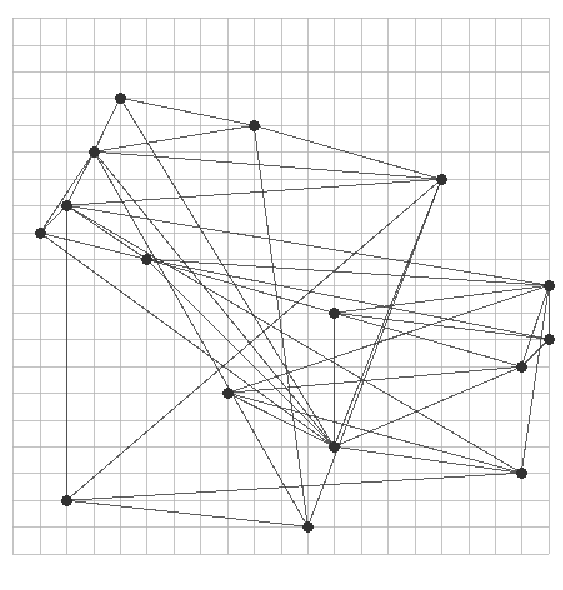

# graph-contest

Given a collection of input graphs that are directed and acyclic, a straight-line upward drawing is a drawing in which each directed edge is represented as a line segment such that the target vertex has a strictly higher y-coordinate than the source vertex. Two edges are said to cross if they do not share an endpoint, but the interiors of their images intersect. We are interested in computing grid drawings: the x-coordinate and y-coordinate of the vertices must be integers on a grid of size [0..width]x[0..height], where width and height are two parameters provided as input of the problem.

The goal in this project is to compute a straight-line upward grid drawing which minimizes the number of edge crossings. In general, computing the crossing number of a graph G, which is the minimal number of crossings on a plane drawing of G, is a very famous problem in Graph Theory, that was shown to be NP-Complete by Garey and Johnson in 1983. 

In our case, we will be trying to compute an upward drawing with as little crossings as possible. For that, we will first compute an initial layout, and then proceed to reduce the number of crossings on it, using two different heuristics : a spring embedding model and a local search heuristic. We will also need to define two functions in order to check the validity of a drawing and compute the number of crossings. Our coding is done in Java.
